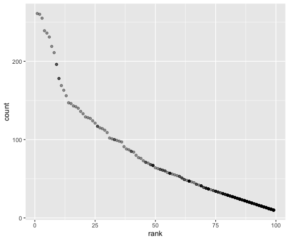

p8105\_hw2\_lc3391
================
Lu Chen
9/28/2019

Problem 1
=========

Read data by sheets, and clean the datasets
-------------------------------------------

``` r
trash_wheel = read_excel( "Trash-Wheel-Collection-Totals-8-6-19.xlsx", sheet = "Mr. Trash Wheel",
                         range = "A2:N338", na = "" ) %>% 
  janitor::clean_names() %>% 
  na.omit() %>% 
  mutate(sports_balls = as.integer(round(sports_balls, 0)))

p_2017 = read_excel( "Trash-Wheel-Collection-Totals-8-6-19.xlsx", sheet = "2017 Precipitation", 
                     range = "A2:B14", na = "") %>% 
  janitor::clean_names() %>% 
  mutate(year = 2017)

p_2018 = read_excel( "Trash-Wheel-Collection-Totals-8-6-19.xlsx", sheet = "2018 Precipitation",
                     range = "A2:B14", na = "") %>%  
  janitor::clean_names() %>% 
  mutate(year = 2018)

combined_p = left_join(p_2017, p_2018, by = c("month")) %>% 
  mutate(Month = month.name)
```

-   There are 286 observations in the dataset Trash Wheel, and one of the key variables is volumn.
-   The number of observations in Combined Precipitation is 12, and the number of precipitation is one of the key variable.
-   The total precipitation rate in 2018 is 70.33, and the median number of sports balls in a dumpster in 2017 is 8.

Problem 2
=========

``` r
pols_month = read_csv(file = "./fivethirtyeight_datasets/pols-month.csv") %>% 
  janitor::clean_names() %>% 
  separate(mon, into = c("year", "month", "day")) %>% 
  mutate(
    month = as.numeric(month),
    month = month.abb[month]
  )
```

    ## Parsed with column specification:
    ## cols(
    ##   mon = col_date(format = ""),
    ##   prez_gop = col_double(),
    ##   gov_gop = col_double(),
    ##   sen_gop = col_double(),
    ##   rep_gop = col_double(),
    ##   prez_dem = col_double(),
    ##   gov_dem = col_double(),
    ##   sen_dem = col_double(),
    ##   rep_dem = col_double()
    ## )

``` r
snp = read_csv(file = "./fivethirtyeight_datasets/snp.csv") %>% 
  janitor::clean_names() %>% 
  separate(col = date, into = c("year", "month", "day")) %>% 
  arrange(as.integer((year), as.integer(month))) %>% 
  select(year, month, everything()) %>% 
   mutate(
        month = as.numeric(month),
        month = month.abb[month]
      )
```

    ## Parsed with column specification:
    ## cols(
    ##   date = col_character(),
    ##   close = col_double()
    ## )

``` r
unemployment = read_csv(file = "./fivethirtyeight_datasets/unemployment.csv") %>% 
  janitor::clean_names() %>% 
  pivot_longer(
    jan:dec, names_to = "month", values_to = "value") %>% 
  mutate(year = as.character(year)) %>% 
  select(year, everything())
```

    ## Parsed with column specification:
    ## cols(
    ##   Year = col_double(),
    ##   Jan = col_double(),
    ##   Feb = col_double(),
    ##   Mar = col_double(),
    ##   Apr = col_double(),
    ##   May = col_double(),
    ##   Jun = col_double(),
    ##   Jul = col_double(),
    ##   Aug = col_double(),
    ##   Sep = col_double(),
    ##   Oct = col_double(),
    ##   Nov = col_double(),
    ##   Dec = col_double()
    ## )

``` r
pols_snp = full_join(pols_month, snp, by = c("year","month"))
pols_snp_unem = full_join(pols_snp, unemployment, by = c("year","month"))
```

Problem 3
=========

``` r
Pop_name = read_csv("Popular_Baby_Names.csv") %>% 
  janitor::clean_names() %>% 
  mutate(gender = str_to_upper(gender), ethnicity = str_to_upper(ethnicity),
         childs_first_name = str_to_upper(childs_first_name)) %>% 
  mutate(ethnicity = recode(
    ethnicity, "ASIAN AND PACI" = "ASIAN AND PACIFIC ISLANDER","BLACK NON HISP" = "BLACK NON HISPANIC",
               "WHITE NON HISP" = "WHITE NON HISPANIC")
    ) %>% 
  distinct()

Olivia = filter(Pop_name, gender == "FEMALE", childs_first_name == "OLIVIA") %>% 
  select(-gender, -childs_first_name, -count) %>%
  arrange(ethnicity, year_of_birth) %>% 
  pivot_wider(names_from = year_of_birth, values_from = rank) %>% 
  knitr::kable()

pop_male = filter(Pop_name, gender == "MALE", rank == 1) %>% 
  select(-gender, -rank, -count) %>% 
  arrange(ethnicity, year_of_birth, childs_first_name) %>% 
  pivot_wider(names_from = year_of_birth, values_from = childs_first_name) %>%
  knitr::kable()

filter(Pop_name, gender == "MALE", ethnicity == "WHITE NON HISPANIC", year_of_birth == 2016) %>% 
  ggplot(aes(x = rank, y = count)) + geom_point(alpha = 0.4)
```


